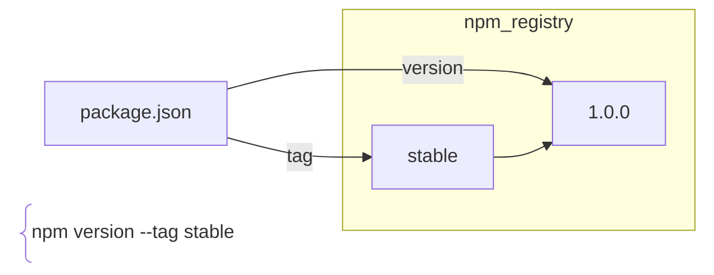

```mermaid
flowchart LR
    package_json["package.json"]
    v_1_0_0["1.0.0"]
    v_stable["stable"]

    subgraph npm_registry
        v_1_0_0
        v_stable
    end

    A@{ shape: comment, label: "npm version --tag stable" }

    package_json -- version --> v_1_0_0
    package_json -- tag --> v_stable
    v_stable --> v_1_0_0 
```
